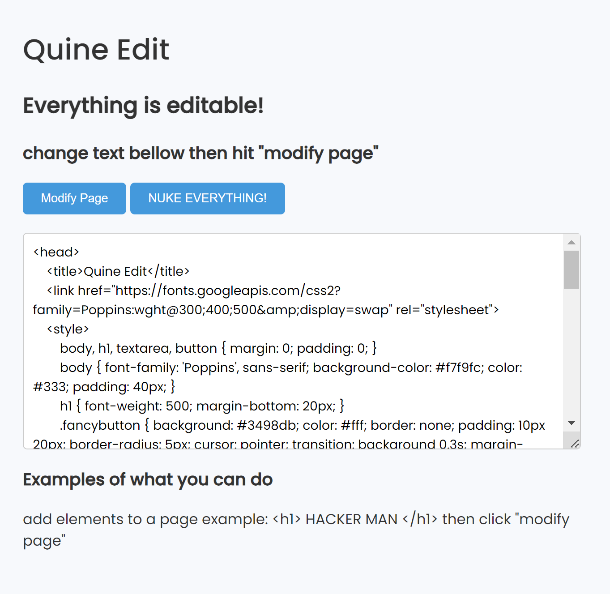

# Quine-edit
https://wisehackermonkey.github.io/quine-edit/

# quine-edit

Quine-edit is a simple web app that allows you to edit the source code and see the changes live in the browser.

## Demo



The source code is displayed in a textarea box. As you edit the HTML, CSS, and JavaScript, the webpage updates in real time. Nothing is safe from the editor even the text box itself!


## Installation

To install the dependencies:

```
git clone https://github.com/yourname/quine-edit.git
cd quine-edit
```

### With Python

```
python -m http.server 8000
```

Then open http://localhost:8000 in your browser. 


## License

This project is open source and available under the [MIT License](LICENSE).